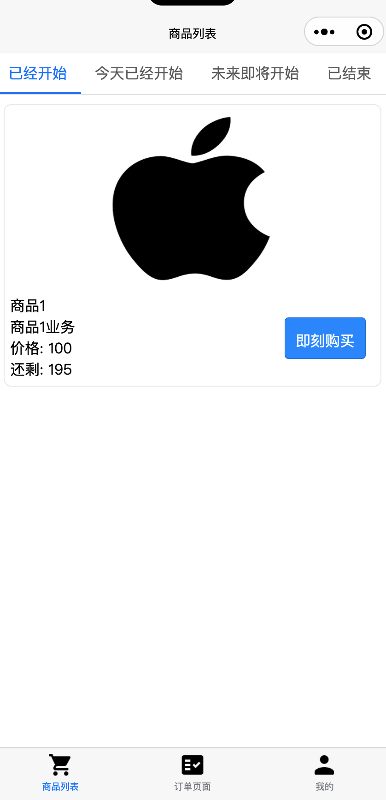
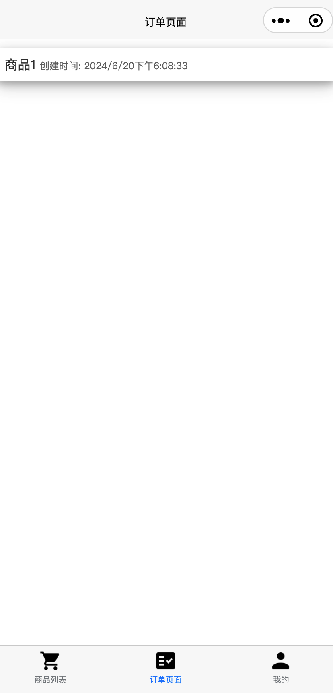

# 简介
[uniapp](https://uniapp.dcloud.net.cn)技术栈的秒杀应用的小程序。

## 项目的前端与后端
- [本项目的后端](https://github.com/weiraneve/seckillcloud)
- [本项目的秒杀部分Web前端](https://github.com/weiraneve/seckill-front)
- [本项目的后台配置部分Web前端](https://github.com/weiraneve/admin-manager)
- [本项目的flutter客户端](https://github.com/weiraneve/seckill-deal)
- [本项目的uniapp小程序端](https://github.com/weiraneve/seckill-mall-miniprogram)

## 界面和功能
- 界面和功能目前没有完全写完，登录功能、具体秒杀轮训能力等等还没有完成，还只是初具规模。UI也还没调整，稍丑。

- 商品列表页面

- 订单页面

