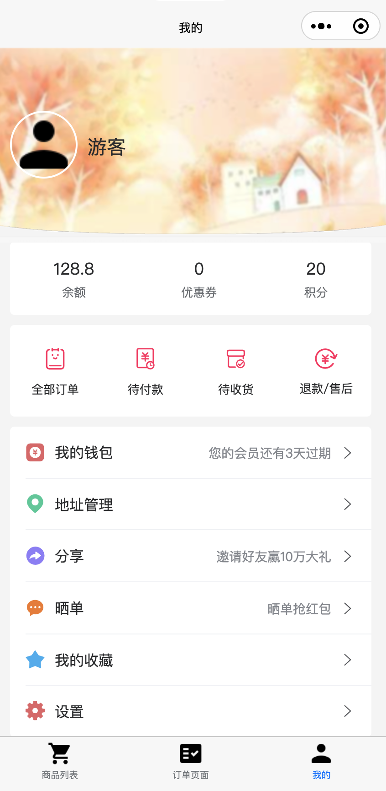

# 简介
[uniapp](https://uniapp.dcloud.net.cn)技术栈的秒杀应用的小程序。使用VUE2的语法。

## 项目的前端与后端
- [本项目的后端(pure)](https://github.com/weiraneve/seckillcloud-pure)
- [本项目的秒杀部分Web前端](https://github.com/weiraneve/seckill-front)
- [本项目的后台配置部分Web前端](https://github.com/weiraneve/admin-manager)
- [本项目的flutter客户端](https://github.com/weiraneve/seckill-deal)
- [本项目的uniapp小程序端](https://github.com/weiraneve/seckill-mall-miniprogram)

## 界面和功能
UI和一些功能暂时没调整。

- 商品列表页面


- 订单页面


- 用户页面



## 使用
首先在根目录下，创建文件`env.js`，内容为
```javascript
export const config = {
    appid: 'XXXX',
    secret: 'XXXX',
};
```
然后就能正常运行，其中内容在微信小程序个人账号里去获得。